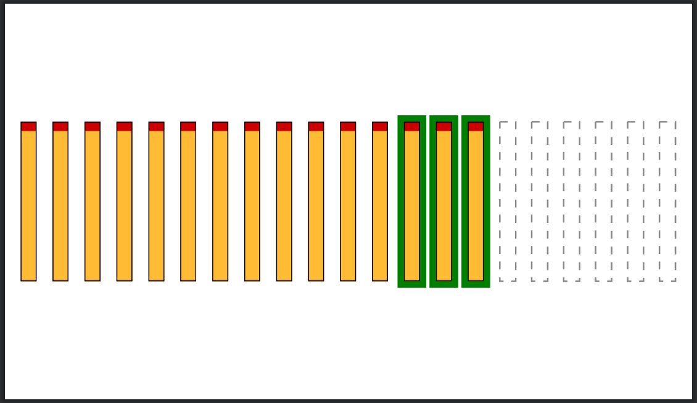
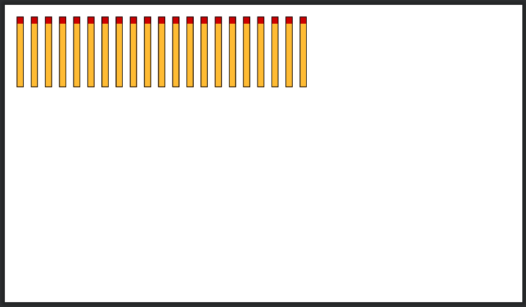
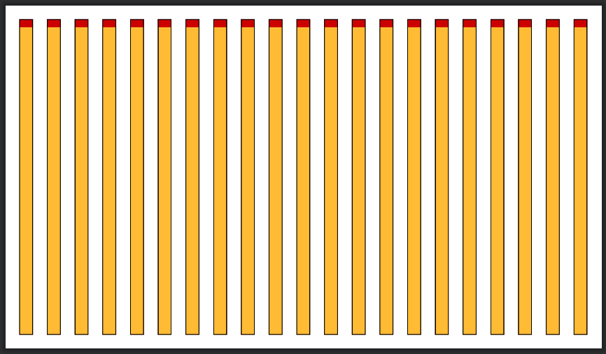
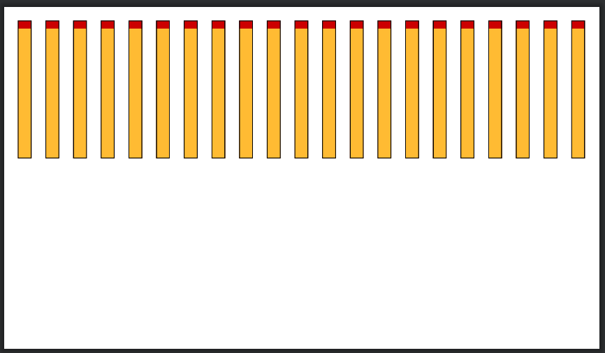
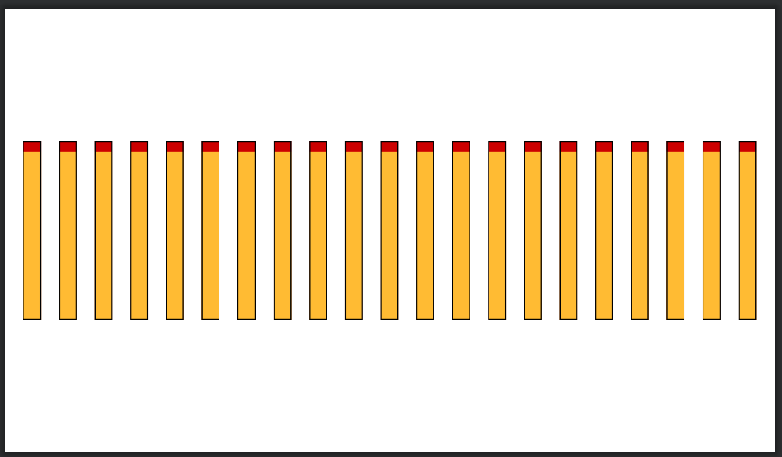
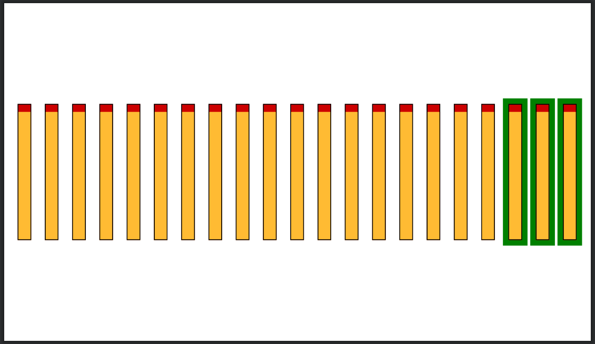
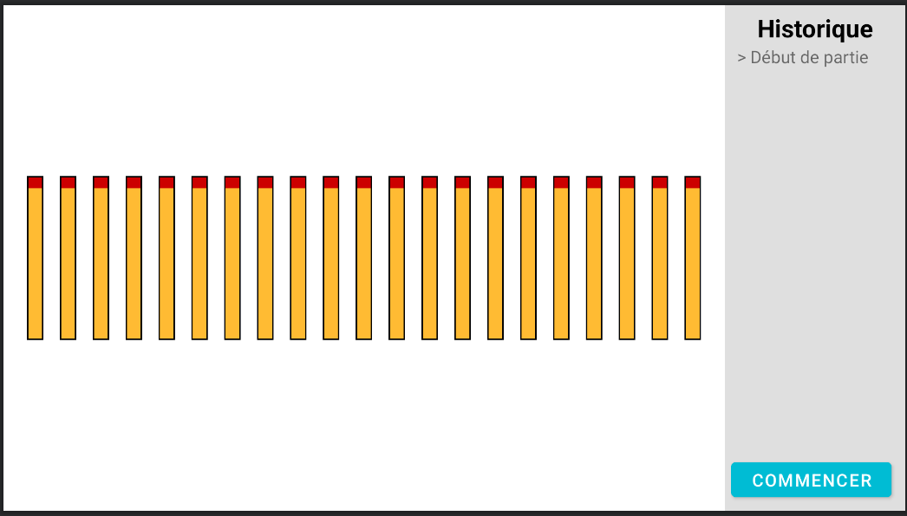
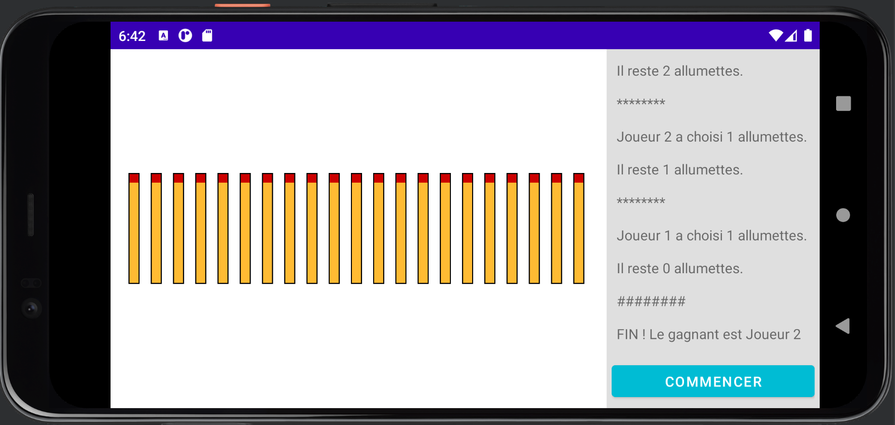
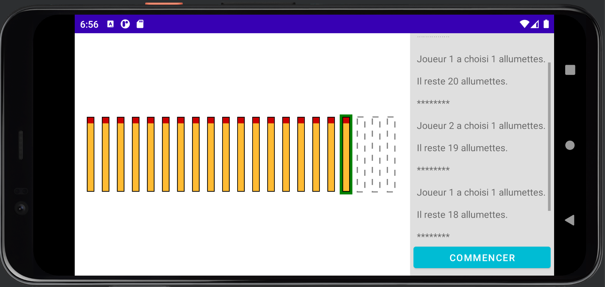
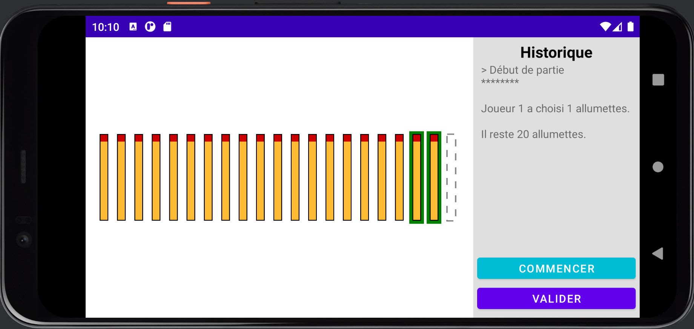

# Jeux des Allumettes

Dans ce Projet vous allez apprendre à faire une `View`, et à faire une synchronisation entre plusieurs `Thread` dans une application Android.

## Le jeu

Le jeu des allumettes est simple à deux joueurs. Il y a N allumettes au départ. A tour de rôle, chaque joueur va prendre, au choix, 1, 2 ou 3 allumettes. Celui qui prend la dernière allumette perd. 

## 1. Créer le projet

Créer un nouveau projet sur Android Studio.

* Choisir le template "Phone and Tablet" / "No Activity"
* Name: Allumettes, Package name : `fr.unice.l3.allumettes`
* Minimum SDK: API 21 Android 5.0

## 2. Faire la `View` pour afficher les allumettes



Il s’agit de créer une `View`, c'est à dire un élément graphique réutilisable personnalisé qui permet d’afficher les allumettes comme illustré ci-dessus. Une fois cette `View` créée, nous pourrons l'insérer dans le layout de notre `Activity` de jeu, tout comme les éléments d'interface disponibles par défaut (ex : Switch, ScrollView, etc).

### 2.1. Mise en place

* Créez une classe `Allumettes.java` héritant de `View` (dans un package `fr.unice.l3.allumettes.view`).
  * Surchargez le constructeur (obligatoire pour surcharger `View`) :
  ```java
  public Allumettes(Context context, @Nullable AttributeSet attrs) {
  super(context, attrs);
  // on complétera ensuite...
  }
	```
  * La classe `Allumettes` va contenir des informations sur l'état actuel du "plateau de jeu". Par exemple vous pouvez faire cela en ajoutant en attributs de cette classe :
    * Le nombre total d'allumettes du jeu (valeur par défaut = 21)
    * Le nombre d'allumettes visibles (valeur par défaut = 21)
    * Le nombre d'allumettes sélectionnées (valeur par défaut = 0)

La `View` se chargera d'agencer à l'écran des allumettes. D'abord on définit le design d'une seule allumette dans un `Drawable` .

* Créez dans votre projet ce fichier `res/drawable/allumette.xml`  dont on fournit un exemple de code (vous pouvez modifier les couleurs ou proportions si souhaité) :

```xml
<?xml version="1.0" encoding="utf-8"?>
<layer-list xmlns:android="http://schemas.android.com/apk/res/android">
    <item>
        <shape android:shape="rectangle">
            <solid android:color="@android:color/holo_red_dark" />
        </shape>
    </item>
    <item android:top="10dp">
        <shape android:shape="rectangle"  >
            <solid android:color="@android:color/holo_orange_light" />
        </shape>
    </item>
    <item >
        <shape android:shape="rectangle"  >
            <stroke android:color="@android:color/black"
                android:width="1dp"/>
        </shape>
    </item>
</layer-list>
```

* Créez une `Activity` (empty activity) `GameActivity` que vous ne modifiez pas pour le moment.

  * Dans `AndroidManifest.xml` déclarez cette `Activity` comme étant l'activité par défaut de cette app :

   ```xml
    ...
    <activity
    	android:name=".GameActivity"
      android:exported="true">
      <intent-filter>
        <action android:name="android.intent.action.MAIN" />
        <category android:name="android.intent.category.LAUNCHER" />
      </intent-filter>
    </activity>
    ...
   ```

  * Dans le `layout` associé à cette activité (`res/layout/activity_game.xml`), insérez en plein écran la `View`, grâce au code suivant par example :

```xml
<?xml version="1.0" encoding="utf-8"?>
<LinearLayout xmlns:android="http://schemas.android.com/apk/res/android"
    xmlns:app="http://schemas.android.com/apk/res-auto"
    xmlns:tools="http://schemas.android.com/tools"
    android:layout_width="match_parent"
    android:layout_height="match_parent"
    tools:context=".GameActivity">

    <fr.unice.l3.allumettes.view.Allumettes
        android:id="@+id/allumettes"
        android:layout_width="match_parent"
        android:layout_height="match_parent" />
</LinearLayout>
```

* Le layout `activity_game.xml` vous servira à tester le rendu visuel de votre `View`, dans la vue "Design". Passez l'orientation du smartphone en format "Landscape" (mais à terme il faudra tester que l'affichage soit satisfaisant dans les 2 orientations).  Pour le moment seul un écran blanc s'affiche.

### 2.2. Dessin des allumettes

* Nous allons maintenant surcharger la méthode `void onDraw(Canvas canvas)` dans la classe `Allumettes` pour dessiner les allumettes.

  * **Affichage naïf** : Considérons d'abord qu'on choisit une **taille fixe** pour chaque allumette (ex : largeur = 30, hauteur = 300)]

    * Récupérez le `Drawable` qui représente une allumette dans le constructeur de `Allumettes`:

     ```java
      public class Allumettes extends View {
        ...
        private Drawable allumette; // stocker la référence au Drawable comme attribut de la classe
        
        public Allumettes(Context context, @Nullable AttributeSet attrs) {
          super(context, attrs);
          allumette = context.getDrawable(R.drawable.allumette);
        }
      }
     ```

    * Surchargez la méthode `void onDraw(Canvas canvas)` pour dessiner les 21 allumettes du jeu. Pour dessiner une allumette on fait :

     ```java
      allumette.setBounds(positionBordGauche, positionBordHaut, positionBordDroit, positionBordBas);
      allumette.draw(canvas)
     ```

    * Ce premier **affichage naïf** des allumettes doit ressembler à peu près à ça : 
    * Notez qu'on a :
      * De l'espace sur les bords verticaux et horizontaux de l'écran (alors que la `View` `allumettes` prend bien toute la place sur l'écran dans le layout)
      * Un espacement égal à la largeur d'une allumette entre 2 allumettes

  * Ce premier affichage n'est pas vraiment satisfaisant, les allumettes ne prennent pas toute la place disponible sur l'écran, et si l'écran était trop étroit elles dépasseraient. Maintenant faites un **affichage responsive** des allumettes, telles que leur largeur et hauteur s'adapte à la taille de l'écran.

    * Surchargez la méthode `void onSizeChanged(int w, int h, int oldw, int oldh)` pour calculer des nouvelles dimensions pour les allumettes selon la taille de l'écran. Cela peut se faire en définissant des attributs `allumetteLargeur` et `allumetteHauteur` sur la classe `Allumettes` et en calculant ces derniers en fonction de la largeur et hauteur de l'écran (`w `et `h` ou accessibles par les méthodes `getWidth()` et `getHeight()`).
    * Le résultat :
    * Bonus : Ces allumettes ne sont pas très esthétiques car elles sont trop étirées (et le résultat est pire en mode portrait...). Définissez un ratio `largeur/hauteur` minimal et maximal pour éviter des étirements extrêmes. Par exemple : `0.1 <= largeur/hauteur <= 0.2`. Alors, si le ratio est trop bas on diminue la hauteur (calculer la hauteur en fonction de la largeur et du ratio minimal de 0.1), et s'il est trop élevé on diminue la largeur de l'allumette (calculer la largeur en fonction de la hauteur et du ratio maximal de 0.2).
    * Bonus : centrez les allumettes verticalement sur l'écran 
    * Bonus : ajoutez la possibilité d'avoir plusieurs lignes d'allumettes, par exemple 2 lignes.

### 2.3. Indication de l'état des allumettes (sélectionnée et enlevée)

* Maintenant nous allons ajouter la possibilité d'afficher un état du jeu où un certain nombre d'allumettes (1, 2 ou 3) sont sélectionnées par un joueur. Dans cet affichage on va toujours considérer qu'on sélectionne et enlève les allumettes **de droite à gauche**, comme vous pouvez le voir sur les images ci-dessous.

  * Ajoutez à la classe `Allumettes` une méthode afin qu'un utilisateur de cette classe puisse modifier l'attribut indiquant le nombre d'allumettes sélectionnées `void setSelectedCount(int s)`.
  * Nous représenterons le fait qu'une allumette est sélectionnée en l'entourant d'un rectangle vert épais. Ci-dessous 3 allumettes sont sélectionnées :
  * Pour dessiner un rectangle vert avec un trait épais, créez un `Paint` `selectedPaint` sur lequel vous réglez
    * la couleur : `selectedPaint.setColor(Color.GREEN)`
    * l'épaisseur : `selectedPaint.setStrokeWidth(...)`
    * le style (on veut dessiner des formes non pleines avec uniquement le trait) : `selectedPaint.setStyle(Paint.Style.STROKE)`
    * dessiner un rectangle est possible dans la méthode `onDraw` en utilisant : `canvas.drawRect(positionBordGauche, positionBordHaut, positionBordDroit, positionBordBas, selectedPaint)`

* Enfin, on affiche les allumettes enlevées de manière différente. On va les représenter par des traits pointillés : 

  * Ici encore il faut que la classe `Allumettes` expose une méthode `setVisibleCount(v)` pour changer le nombre d'allumettes visibles.
  * Pour dessiner des traits pointillés, on crée un `Paint` `removedPaint` sur lequel on ajoute un effet :

   ```java
   removedPaint.setPathEffect(new DashPathEffect(new float[] {25, 25}, 0));
   ```

* Enfin, ajoutez à la classe `Allumettes` un setter afin qu'un utilisateur de cette classe puisse modifier l'attribut indiquant le nombre d'allumettes totales du jeu (utile plus tard).

* Testez le comportement de votre classe `Allumettes` en appelant manuellement les méthodes pour changer le nombre d'allumettes totales, visibles et sélectionnées (par exemple depuis la méthode `onCreate` de l'activity `GameActivity`).

```java
  @Override
  protected void onCreate(Bundle savedInstanceState) {
    super.onCreate(savedInstanceState);
    setContentView(R.layout.activity_game);
    
  	// gameView est un attribut de la classe
    gameView = findViewById(R.id.allumettes);
  
    // Changer le nb total d'allumettes...
    gameView....(...);
    // Changer le nb d'allumettes sélectionnées...
    ...
  }
```

## 3. Mise en place du jeu : le moteur de jeu, les IA et le contrôleur

### 3.1. Mise en place du moteur de jeu

* Récupérez les classes [`JeuDesAllumettes`](JeuDesAllumettes.java) et [`Joueur`](Joueur.java) sur le repo et parcourez les.
* Explication : ces classes de base définissent les règles du jeu et la manière dont un joueur intéragit avec le jeu :
  * `JeuDesAllumettes` stocke l'état actuel de la partie de jeu des allumettes, et expose des méthodes pour agir sur cette partie (ajouter un joueur, faire jouer le joueur dont c'est le tour, déterminer s'il y a un gagnant, etc)
  * `Joueur` représente un joueur et comporte une méthode `jouer` qui définit le comportement du joueur lors d'un tour. Pour le moment ce joueur de base va toujours choisir 1 allumette à son tour.

### 3.2. Compléter l'interface graphique du jeu

* On va modifier l'interface graphique du jeu (en modifiant le fichier `res/layout/activity_game.xml`). On ajoute 2 éléments pour permettre de
  * afficher l'historique d'une partie (un `TextView` dans un `ScrollView`)
  * lancer une partie (via un `Button`)
* Voici un exemple d'UI, mais libre à vous de faire comme vous préférez tant que ces 2 éléments sont présents. Dans cet exemple il y a 2 `TextView` dans le `ScrollView`, un qui affiche le titre (`Historique`) et un autre dans lequel on affichera l'historique depuis la future classe `Controleur` (avec comme texte par défaut `> Début de partie`).



### 3.3. Lancer une partie entre 2 joueurs IA

Dans cette section on va faire en sorte qu'une partie entre 2 joueurs IA se lance lorsqu'on appuie sur le bouton "Commencer" de l'application.

* Créer une classe `Controleur` dans un package `fr.unice.l3.matchesgame.control`

* Cette classe doit avoir en **attribut** une référence vers une instance `jeu` de la classe `JeuDesAllumettes`. Cette référence sera passée via le **constructeur**.

* Cette classe doit avoir deux méthodes `void start()` et `void stop()` qui permettent de lancer le processus d'une partie ainsi que d'en stopper l'exécution.

* Le processus gérant une partie ne peut pas se faire sur le thread principal (graphique). En effet, ce processus doit tourner *en parrallèle* du thread graphique, puisqu'il va effectuer des pauses (pour un joueur IA) ou attendre des entrées utilisateurs (pour un joueur humain), ce qui ferait "freezer" l'interface de notre application si fait sur le thread principal. Nous souhaitons également mettre à jour l'UI de temps en temps (pour indiquer un nouveau coup par exemple). Le plus simple est d'utiliser une `AsyncTask`.

  * La classe `Controleur` doit avoir un attribut `partie` de type `AsyncTask<Void, String, String>`. (Cette `AsyncTask` ne prend pas de paramètres donc `Void`, elle renvoie comme donnée de progression des messages `String` et comme résultat final un message `String`)

  * Dans la méthode `start`, on initialise `partie`. Plusieurs options possibles : utiliser une classe anonyme `partie = new AsyncTask<Void, String, String>() { ... }`, ou définir une classe ` Partie` qui hérite de `AsyncTask<Void, String, String>` (dans ce cas il vaut mieux que `Partie` soit une classe interne de `Controleur` pour pouvoir accéder aux attributs de celui-ci directement). 

  * Il faut surcharger la méthode `doInBackground` de `AsyncTask` pour définir ce qui se passe pendant la partie, voici une ébauche possible (incomplète). Il faut utiliser des méthodes de `jeu`.

  ```java
    @Override
    protected String doInBackground(Void... params) {
      Log.d("Partie", "Debut de partie.");
      try {
        // Tant que la partie du jeu d'allumettes est en cours (pas encore de gagnant)
        while(...) {
          // Quel est le joueur dont c'est le tour ?
          Joueur j = ...;
          // Combien d'allumettes sont choisies lors de ce tour de jeu ?
          int nbAllumettesChoisies = ...;
          
          // 1er message : on affiche le coup (allumettes choisies)
          Log.d("Partie", "Le joueur : " + j.toString() + " choisit " + " " + nbAllumettesChoisies + " allumettes.");
          
          // Marquer une pause pour laisser le temps de voir le coup
          j.attendre();
          
          int nbAllumettesVisibles = ...;
          
          // 2e message : on affiche le résultat de ce tour (allumettes restantes)
          Log.d("Partie", "Il reste " + nbAllumettesVisibles + " allumettes.");
        }
      } catch (InterruptedException e) {
        e.printStackTrace();
      }
    	Log.d("Partie", "Fin de partie.");
      // Afficher le gagnant
      Log.d("Partie", "Gagnant : " + ...);
      
      return "Le gagnant est ...";
    }
  ```

  * Dans la méthode `start`, on réinitialise la partie de jeu (en utilisant une méthode de `jeu`) puis on lance le processus défini juste avant : `partie.execute()`. La méthode pour arrêter ce processus est `partie.cancel(true)`, à vous de voir où il faut l'appeler.

* Afin de tester le `Controleur` il faut modifier `GameActivity` pour que lors d'un clic sur le bouton `Commencer`, on puisse lancer une partie de jeu via le contrôleur. Pour cela il faut aussi créer une instance de `JeuDesAllumettes`, lui assigner 2 joueurs, et créer une instance de `Controleur`.

* Maintenant, lors d'un clic sur le bouton `Commencer`, vous devez avoir l'historique de la partie qui s'affiche dans la console. Dans les parties suivantes on va mettre à jour l'UI de l'application en fonction de ces informations sur la partie en cours.

### 3.4. Mettre à jour l'inteface graphique du jeu

#### a. Afficher l'historique de la partie

* Au lieu d'afficher les messages de progression dans la console, on souhaite mettre à jour le contenu de la `TextView` qui contient l'historique des coups de la partie sur l'UI.

* Pour cela il faut que la classe `Controleur` puisse accéder à la `TextView` qui contient l'historique.

  * Cela peut se faire en passant une référence à `GameActivity` via le constructeur. 
  * `GameActivity` doit exposer une méthode `void updateView(String message)`.
  * Cette méthode `updateView` se charge alors d'ajouter le texte `message` à la `TextView` de l'historique. 
  * Il est aussi bien de scroller : `scrollView.fullScroll(View.FOCUS_DOWN);` 

* Dans la méthode `doInBackground` de notre `AsyncTask` sur laquelle se joue la partie, nous ne pouvons pas modifier l'UI (par exemple en appelant `updateView`) car nous ne nous trouvons pas sur le thread UI. Pour mettre à jour l'UI depuis la méthode `doInBackground` il faut :

  * Appeler la méthode `publishProgress` en passant en argument le message ("X a choisi n allumettes").

  * Surcharger la méthode :

  ```java
  @Override
  protected void onProgressUpdate(String[] values) {
    super.onProgressUpdate(values);
    String message = values[0];
    // On peut maintenant modifier l'UI pour ajouter "message" à l'historique de la partie
    ...
  }
  ```

* Remplacez les 2 messages `Log.d(...)` par des mises à jour de l'historique dans l'UI.

* Pour afficher le gagnant, on surcharge la méthode `protected void onPostExecute(String s)` de la même manière que `onProgressUpdate`. Il faut bien que `doInBackground` renvoie un message tel que "Le gagnant est ...".

* Voici un example de ce que vous devez obtenir après avoir lancé la partie en cliquant sur `Commencer` :



#### b. Mettre à jour la vue du plateau de jeu

* Pour rendre le jeu plus visuel, nous allons modifier l'aspect du plateau de jeu graphique créé dans la partie 2, la classe `Allumettes`. Le nombre d'allumettes sélectionnées à chaque tour sera indiqué par des allumettes entourées de vert, et les allumettes retirées seront affichées en pointillé. Voilà un exemple de ce qu'on va obtenir à la fin de cette section :



* Pour afficher les allumettes sélectionnées et visibles, on peut utiliser les méthodes de `Allumettes`, `setSelectedCount(...)` et `setVisibleCount(...)`.
  * Pour appeler ces méthodes depuis `Controleur`, soit il faut une référence vers la vue `Allumettes` passée via le constructeur, soit `GameActivity` peut exposer des méthodes pour accéder à `Allumettes` ou à ses méthodes
* On aimerait avoir 2 comportements de mise à jour de la vue différents : (1) lors du message de coup principal, on veut afficher le nombre d'allumettes sélectionnées (voir ci-dessus), (2) lors du message de coup "après le coup" on veut afficher le nombre d'allumettes visibles à cet instant là, et 0 allumettes sélectionnées (voir ci-dessous).


* Au lieu de passer simplement un message `String` à `onProgressUpdate`, on va passer à cette méthode des instances d'une classe `UpdateMessage` que nous allons créer. Cela nous permettra d'avoir une information plus structurée sur la mise à jour à afficher, notamment le nombre d'allumettes choisies.

  * Créer une classe abstraite privée interne dans la classe `Controleur` :

  ```java
  private abstract class UpdateMessage {
    protected int nbAllumettesChoisies;
    protected Joueur j;
  
    public UpdateMessage(Joueur j, int nbAllumettesChoisies) {
      this.j = j;
      this.nbAllumettesChoisies = nbAllumettesChoisies;
    }
  
    public abstract void updateView();
  }
  ```

  * Créer 2 classes qui héritent de `UpdateMessage` : `MainUpdateMessage` et `PostUpdateMessage`.
  * Dans la classe `MainUpdateMessage` `updateView` effectue une mise à jour de l'UI comme montré sur la première image (on affiche le nombre d'allumettes sélectionnées, on écrit un message de type `Joueur x a choisi n allumettes`).
  * Dans la classe `PostUpdateMessage`  `updateView` effectue une mise à jour de l'UI comme montré sur la deuxième image (on sélectionne 0 allumettes, on met à jour le nombre d'allumettes visibles, on écrit un message de type `Il reste n allumettes`).
  * Modifiez les paramètres de type de la `AsyncTask` car maintenant les paramètres de progrès sont de type `UpdateMessage`. On a donc : `AsyncTask<Void, UpdateMessage, String>`, et `onProgressUpdate(UpdateMessage[] values)`
  * La méthode `onProgressUpdate` peut être simplifiée et juste utiliser la méthode `updateView` de la classe `UpdateMessage`
  * Dans `doInBackground` on ne passe plus un message `String` à `publishProgress`, mais une instance des classes `MainUpdateMessage` ou `PostUpdateMessage`, selon le cas.
  * Après avoir mis à jour l'instance de `Allumettes` (par exemple en changeant le nombre d'allumettes sélectionnées), il faut appeler la méthode `invalidate()` sur cette instance pour indiquer que l'on souhaite que cette `View` soit rendue de nouveau.

* Enfin, testez que lors d'un appui sur `Commencer` on a bien une partie qui se joue avec mise à jour de la vue du plateau et affichage des messages dans l'historique.

### 3.5. Des joueurs IA plus intéressants

Le jeu des allumettes que nous avons créé fait partie d'une classe de jeu appelés [Jeux de Nim](https://fr.wikipedia.org/wiki/Jeux_de_Nim). Ce type de jeu comporte une stratégie gagnante, c'est à dire que si on la suit et que l'on se trouve dans une position gagnante, on est sûr de l'emporter.

La stratégie consiste à toujours laisser dans la partie (après son coup) un nombre d'allumettes tel que ce nombre est égal à un multiple de 4 + 1. Par exemple il faut laisser un nombre d'allumettes égal à : 1, 5, 9, 13, etc. Donc s'il reste 15 allumettes à mon tour, j'en choisis 2 pour en laisser 13.

* Pour le moment votre joueur "IA" défini par la classe `Joueur` ne prend toujours que 1 allumette. On va définir 2 nouveaux types de joueurs IA qui ont des comportements différents :
  * Le joueur `JoueurRandom` qui prend au hasard entre 1 et 3 allumettes à chaque tour.
  * Le joueur `JoueurSmart` qui suit la stratégie gagnante du jeu. Il choisira toujours un nombre d'allumettes tel que `(nbVisibles - nbChoisies) % 4 == 1` si cela est possible, sinon il choisira 1 allumette.
* Implémentez ces différents types de joueurs comme des classes héritant de la classe de base `Joueur` et surchargeant la méthode `jouer`. Ensuite testez les en changeant les joueurs créés dans `GameActivity`.

## 4. Interface pour un joueur humain

On veut ajouter une manière pour un joueur humain de choisir le nombre d'allumettes qu'il ou elle veut choisir lors de son coup. On va commencer par faire une interface tactile : le joueur va cliquer sur la `View` `Allumettes` pour changer le nombre d'allumettes sélectionnées, puis il ou elle va cliquer sur un bouton `Valider` pour confirmer son choix.

* Ajouter un bouton `Valider` dans l'interface de votre application, par exemple comme ceci :



* On va avoir un `JoueurHumain` qui utilise une `InteractionTactile` pour attendre et connaître le coup choisi par l'utilisateur.

  * Créez une classe `JoueurHumain` qui hérite de `Joueur`.
  * Cette classe a un attribut `interaction` de type `InteractionTactile` qui est une classe qu'il vous faut créer aussi.

* On commence par compléter la classe `InteractionTactile`. Ses attributs et méthodes :

  * un attribut `synchro` de type `Object`. Cet objet servira à synchroniser les actions de cette classe (attente d'une entrée utilisateur, puis validation du coup) avec le processus principal de l'application.

  * un attribut de type `int` qui sert à stocker le nombre d'allumettes sélectionnées par le joueur lors de ce coup

  * un attribut `active` de type `boolean` qui indique si l'interface tactile est "activée" (elle l'est seulement lorsqu'on appelle la méthode `startTurn`). Lorsque l'interface est activée, on incrémentera le nombre d'allumettes sélectionnées lorsque le joueur clique sur l'écran, sinon on ne fait rien.

  * une méthode `public Object startTurn()`  qui indique qu'on démarre le "tour" de jeu de l'utilisateur. On renvoie l'objet `synchro` qui servira sur le thread principal à "attendre" l'événement de fin du tour.

  * une méthode `public int endTurn()` qui renvoie le nombre d'allumettes sélectionnées et met `active` à `False`

  * cette classe hérite de `View.OnClickListener`. La méthode `onClick` doit supporter 2 comportements :

    * si le clic est sur la `view` `Allumettes`, alors on incrémente le nombre d'allumettes sélectionnées (ce nombre doit varier entre 1 et 3, vous pouvez utiliser l'opérateur `%`)

    * si le clic est sur le bouton `Valider`, alors on "notifie" l'objet `synchro` de la fin du tour :

     ```java
     // Si le bouton Valider est cliqué
     if (...) {
        synchronized (synchro) {
          synchro.notify();
        }
     }
     ```

* Ensuite on complète la classe `JoueurHumain` :

  * il faut un constructeur qui prend en argument un objet `InteractionTactile`
  * la méthode `jouer` fait appel à l'attribut `interaction` pour lancer le thread "d'attente" du coup humain, puis elle attend `synchro.wait()` que le coup soit validé :
  
   ```java
    @Override
    public int jouer(int nbAllumettesVisibles) throws InterruptedException {
      int nbSelected = 1;
      Object synchro = interaction.startTurn();
      synchronized (synchro) {
        synchro.wait();
        nbSelected = interaction.endTurn();
      }
      return nbSelected;
    }
   ```
  
  * la méthode `attendre` est vide puisqu'il n'y a pas besoin de mettre une attente artificielle pour le joueur humain
  
* Il faut instancier `InteractionTactile` dans `GameActivity` pour pouvoir créer un `JoueurHumain`. Il faut ajouter cette instance de `InteractionTactile` comme `onClickListener` sur le bouton `Valider` et sur la vue `Allumettes`.

* Testez votre jeu en regardant si vous pouvez bien choisir différents nombres d'allumettes et jouer une partie. Pour faciliter le test vous pouvez utiliser des `Log.d(...)` pour afficher le nombre d'allumettes choisies.

* Enfin, on veut pouvoir mettre à jour la `View` `Allumettes` lors du clic de l'utilisateur, pour que le nombre d'allumettes affichées comme sélectionnées soit cohérent (comme sur l'image ci-dessus où 2 allumettes sont sélectionnées).

  * Il faut pouvoir appeler la méthode `setSelectedCount(...)` de `gameView` (attribut de `GameActivity`). Par exemple vous pouvez créer une méthode `public void updateGameView(int nbSelected)` dans `GameActivity`

  * Pour pouvoir mettre à jour l'UI depuis un thread autre que le thread UI, il faut utiliser un `Runnable`:

  ```java
  // Dans GameActivity
  public void updateGameView(int nbSelected) {
    runOnUiThread(new Runnable() {
        @Override
        public void run() {
          this.gameView.setSelectedCount(nbSelected);
          this.gameView.invalidate();
        }
    });
  }
  ```
  
  * `InteractionTactile` doit alors avoir une référence vers `GameActivity`. Elle peut être passée via le constructeur.
  
* À la fin de cette partie, vous devriez avoir un jeu jouable à 1 joueur contre l'IA ! Félicitations !

## 5. Bonus

En bonus vous pouvez :

* Implémenter une interaction via l'accéléromètre. Plutôt que de toucher la vue, le joueur va maintenant incliner le téléphone sur la droite ou sur la gauche pour diminuer ou augmenter le nombre d’allumettes sélectionnées.
* Ajouter un menu de réglages qui permet de choisir le nom des joueurs, leur type (quelle IA), le type d'interaction (tactile ou accéléromètre)

Plus d'instructions sont disponibles sur le document Word original du TP (voir moodle).
